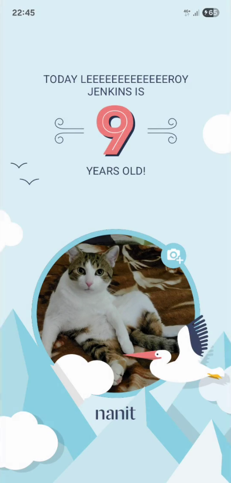

# Birthday
## Overview
Receive a kid's [Name, Date of Birth, Theme] via WebSocket. Then, show a Happy Birthday screen according to company design. Allow selection of avatar via Camera or Gallery.

## Videos
https://github.com/vladislav-iliev/home-task-birthday/blob/main/media/demo.mp4

## Design

## Inside

Upon app start, these components are started - a Repository for the WebSocket 'networking/Repository' to handle the connections, and a Repository for the avatar 'kid/avatar/Repository'.

The beginning destination 'screens/connect/ConnectScreen' has its ViewModel accept all aforementioned components, even though not all are used - this is to force Dagger-Hilt to instantiate them from the beginning of the app.

The combination of a kid's Text (name, age and theme) and Avatar form the kid's state 'kid/State'. Also 
in the state is a flag showing if the server connection is active (a boolean value isActive). When isActive goes false,
 we go back to the connect screen, since the kid is offline.
